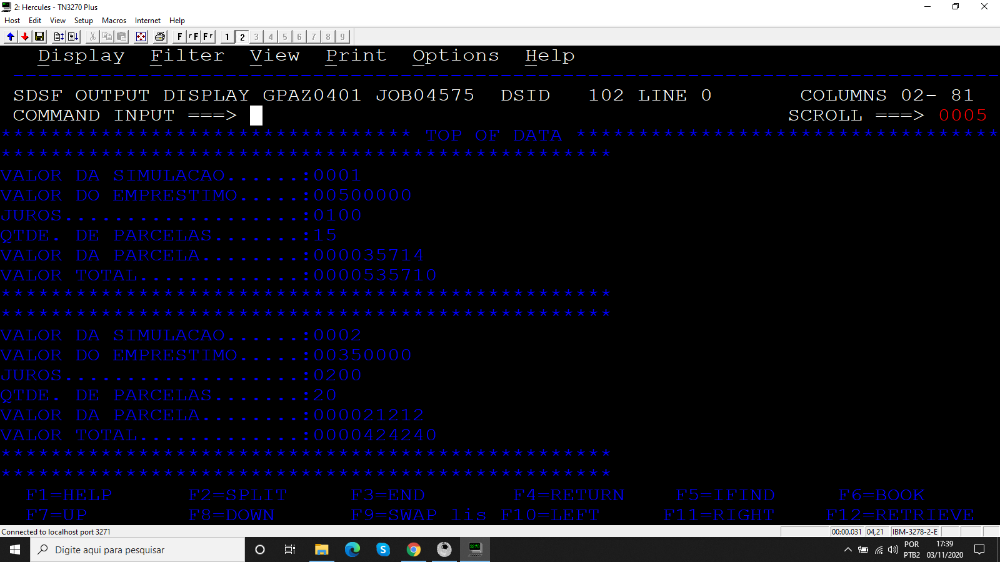

# Projeto_01
## Simulador de empréstimos

Programa desenvolvido durante o treinamento de Cobol da escola Grande Porte treinametos.

## Objetivo

Calcular a simulação de empréstimos fornecidos via SYSIN e exibir os resultados na SYSOUT.

### Arquivos

* Código
* JCL

### Resultados

