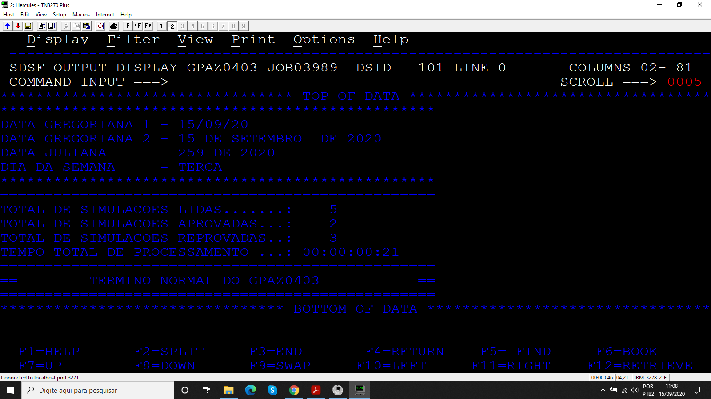
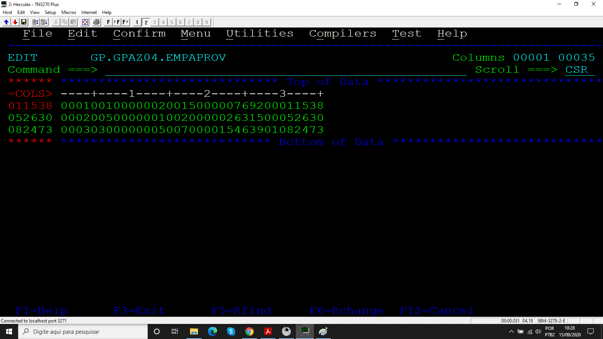

# Projeto_02
## Simulador de empréstimos com saída formatada

Programa desenvolvido durante o treinamento de Cobol da escola Grande Porte treinametos.

## Objetivo

Calcular a simulação de empréstimos fornecidos por um arquivo sequencial SIMUEMP e gravar seus resultados em outro arquivo chamado EMPAPROV além disso exibir os resultados formatados na SYSOUT, exibindo data em 4 formatos, total de simulações lidas, total de simulações processadas e tempo total de processamento.

### Arquivos

* Código
* JCL
* SIMUEMP
* EMPAPROV

### Resultados

