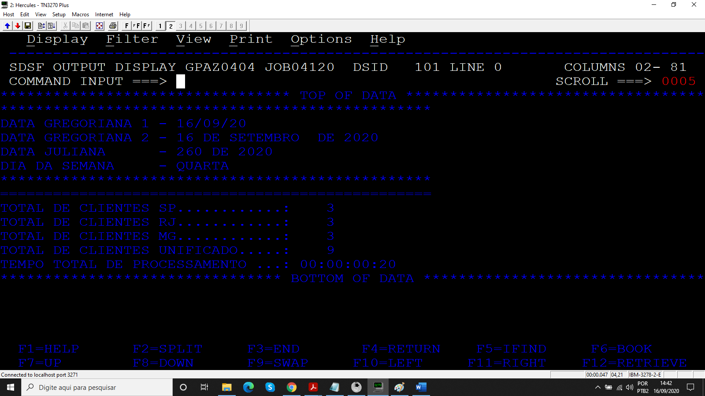

# Projeto_04
## Merge entre três arquivos de entrada

Programa desenvolvido durante o treinamento de Cobol da escola Grande Porte treinametos.

## Objetivo

O programa realiza um merge entre três arquivos de entrada CLISP, CLIRJ, CLIMG gravando em um arquivo de saída CLIUNIF.

### Arquivos

* Código
* JCL
* CLISP, CLIRJ, CLIMG
* CLIUNIF

### Resultados

