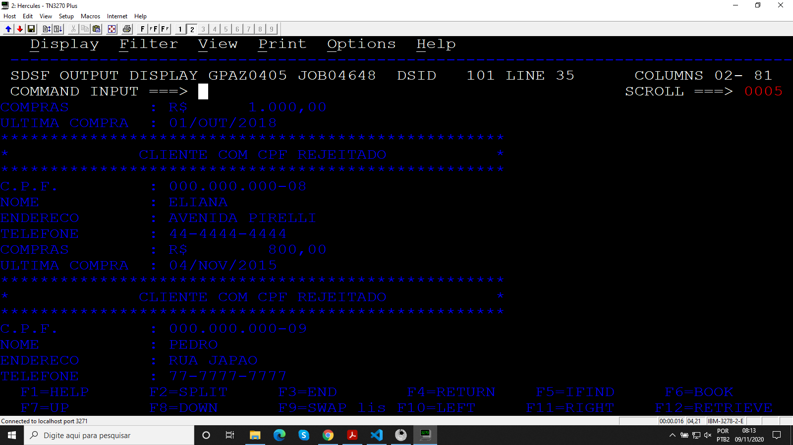
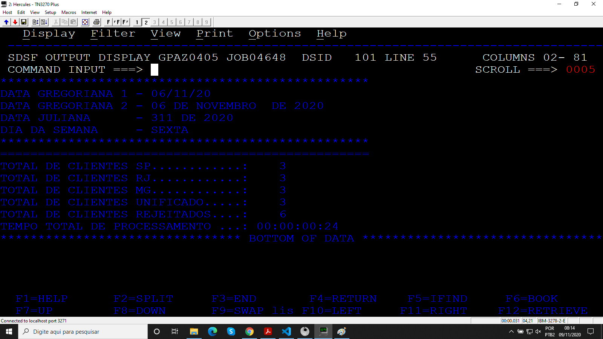

# Projeto_05
## Merge entre três arquivos de entrada

Programa desenvolvido durante o treinamento de Cobol da escola Grande Porte treinametos.

## Objetivo

O programa realiza um merge entre três arquivos de entrada CLISP, CLIRJ, CLIMG gravando em um arquivo de saída CLIUNIF somente arquivos com CPFs válidos. Para fazer a verificação é usado um sub-programa PGMAUX01, além disso é mostrado na SYSOUT os clientes com CPFs inválidos e resumo do processamento.

### Arquivos

* Código
* JCL
* CLISP, CLIRJ, CLIMG
* CLIUNIF
* PGMAUX01

### Booklib

* CADCLI
* VARDATA
* VARTEMPO
* ROTDATA
* ROTERRO

### Resultados

