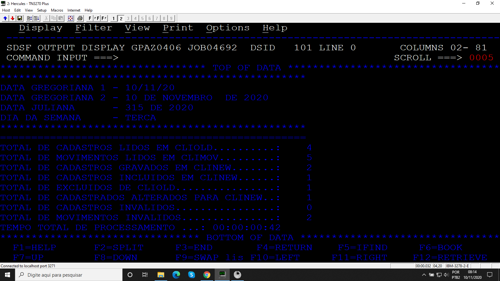

# Projeto_06
## Balance line entre dois arquivos de entrada

Programa desenvolvido durante o treinamento de Cobol da escola Grande Porte treinametos.

## Objetivo

O programa realiza um balance line entre dois arquivos de entrada CLIOLD e CLIMOV, gravando em um arquivo de saída CLINEW com base no tipo do movimento I (incluir), A (atualizar), E (excluir) qualquer outro tipo de movimento deve ser considerado como movimento inválido. Se o tipo de movimento for igual a A (atualizar) um sub-programa deve ser chamado para calcular o novo valor da dívida, além disso é mostrado na SYSOUT a estatística do processamento.

### Arquivos

* Código
* JCL
* CLIOLD, CLIMOV
* CLINEW
* PGMAUX02

### Booklib

* CADCLIBL
* CADCLIMV
* VARDATA
* VARTEMPO
* ROTDATA
* ROTERRO
* CALCTEMP

### Resultados

