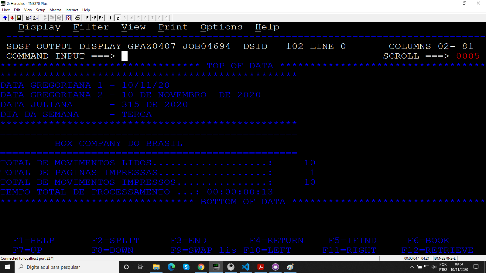
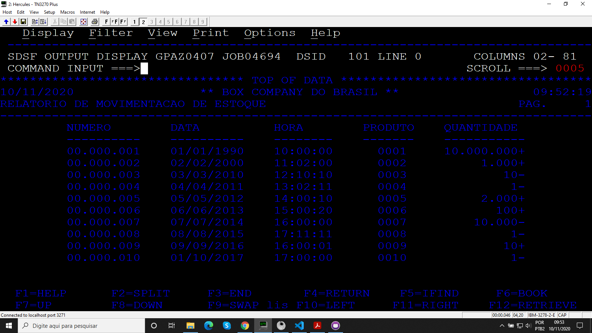

# Projeto_07
## Relatório de movimentação de estoque

Programa desenvolvido durante o treinamento de Cobol da escola Grande Porte treinametos.

## Objetivo

O programa monta um relatório com 80 colunas e 50 linhas com base no arquivo de entrada MOVTOEST, além disso é mostrado na SYSOUT a estatística do processamento.

### Arquivos

* Código
* JCL
* MOVTOEST

### Booklib

* VARDATA
* VARTEMPO
* ROTDATA
* ROTERRO
* CALCTEMP

### Resultados

