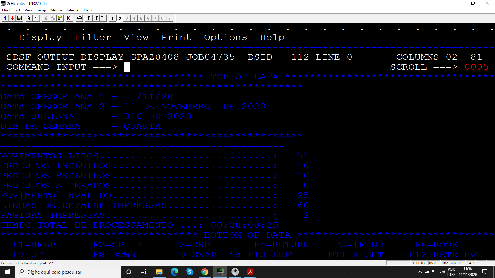
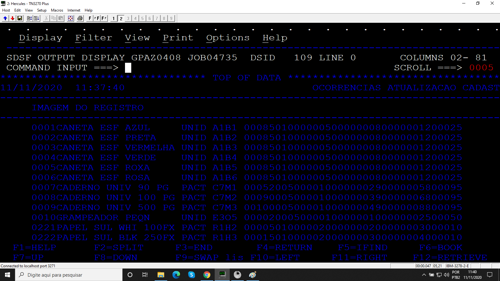
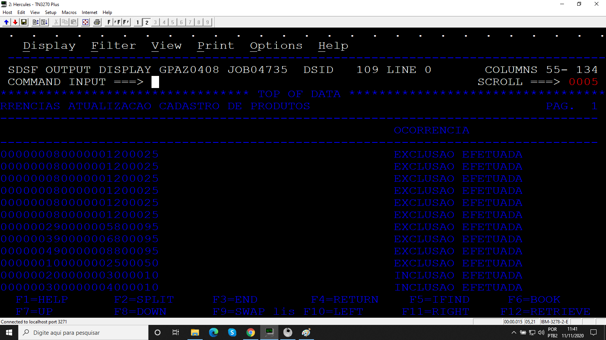

# Projeto_08
## Relatório de atualização de estoque

Programa desenvolvido durante o treinamento de Cobol da escola Grande Porte treinametos.

## Objetivo

O programa monta um relatório com 132 colunas e 50 linhas com base no arquivo de entrada CADPRD e MOVPRD. O arquivo MOVPRD atualiza o cadastro de clientes e pode efetuar as seguintes operações A (atualizar), E (excluir), I (incluir), o arquivo CADPRD deve ser do tipo VSAM e é usado um programa para carregar esse arquivo, além disso é mostrado na SYSOUT a estatística do processamento.

### Arquivos

* Código 
  * programa principal
  * programa para carregar arquivo VSAM
* JCL 
  * programa principal
  * programa para carregar arquivo VSAM
* MOVPRD
* CADPRD

### Booklib

* VARDATA
* VARTEMPO
* ROTDATA
* ROTERRO
* CALCTEMP
* MOVPRD
* VCADPRD

### Resultados

