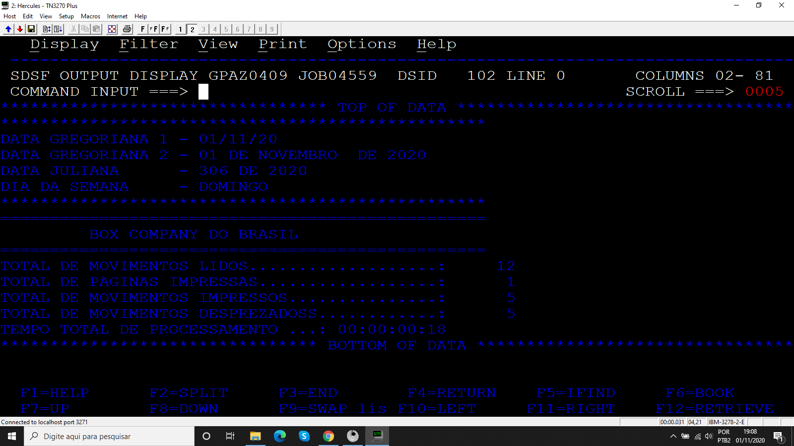
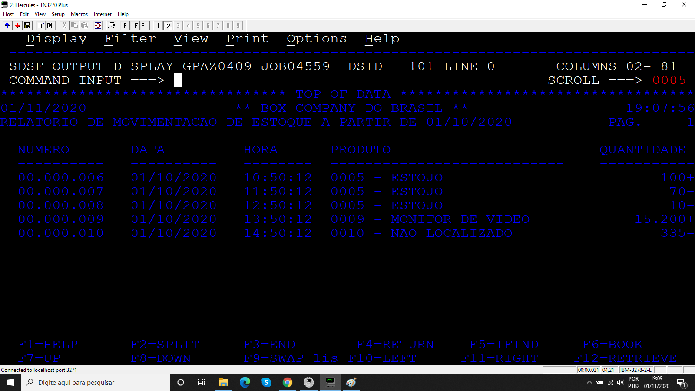

# Projeto_09
## Relatório de movimentação de estoque

Programa desenvolvido durante o treinamento de Cobol da escola Grande Porte treinamentos.

## Objetivo

O programa monta um relatório com 80 colunas e 50 linhas com base no arquivo de entrada CADPROD e MOVTO. É informado uma data via PARM do JCL para filtrar produtos com data igual ou superior a de entrada e também um sub-programa que classifica os produtos em alta prioridade(1) e baixa prioridade (0), além disso é mostrado na SYSOUT a estatística do processamento.

### Arquivos

* Código 
  * programa principal
  * sub-programa
* JCL 
* MOVTO
* CADPROD

### Booklib

* VARDATA
* VARTEMPO
* ROTDATA
* ROTERRO
* CALCTEMP
* MOVTO

### Resultados

