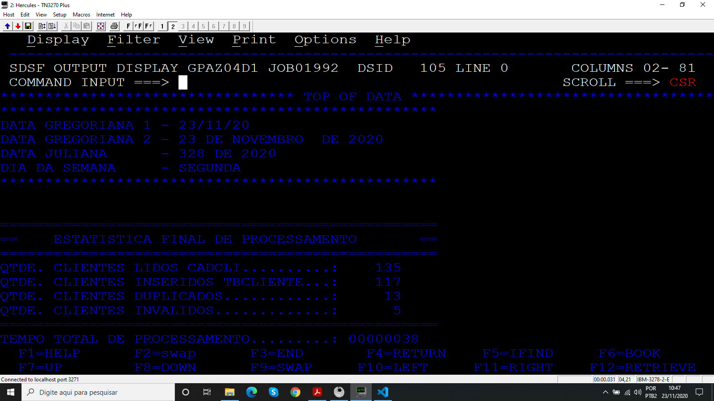
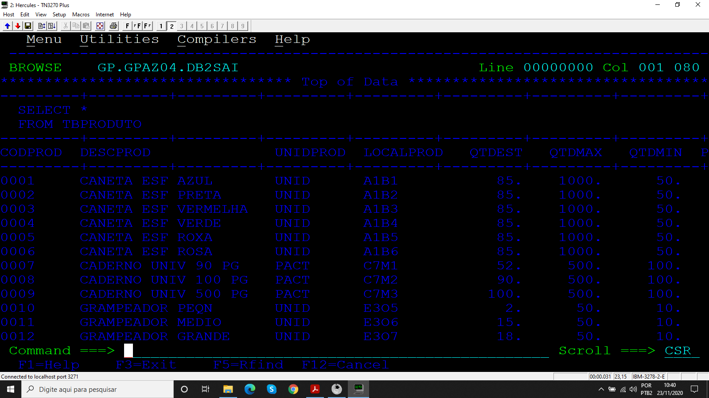

# Projeto_10
## Programa para carregar tabela DB2

Programa desenvolvido durante o treinamento de Cobol da escola Grande Porte treinametos.

## Objetivo

O programa lê os produtos do arquivo sequencial CADPRDD1 e carrega a tabela TBPRODUTO, além disso é mostrado na SYSOUT a estatística do processamento.

### Arquivos

* Código 
* JCL 
  * COMPCOBDB2
  * EXECOBD1
* CADPRDD1

### Booklib

* VARDATA
* VARTEMPO
* ROTDATA
* ROTERRO
* CALCTEMP
* BK001D1
* BK002TP

### Resultados

