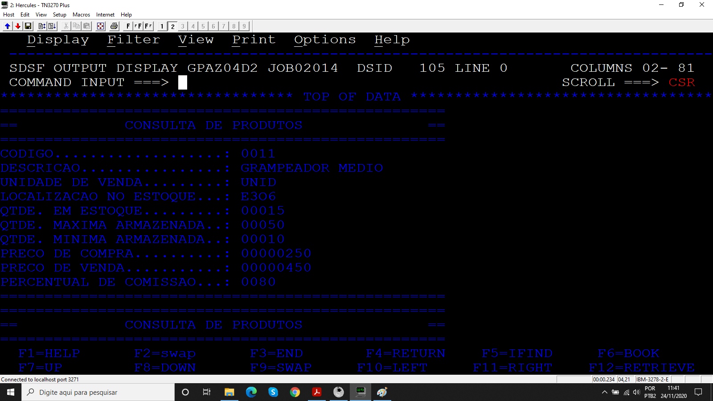
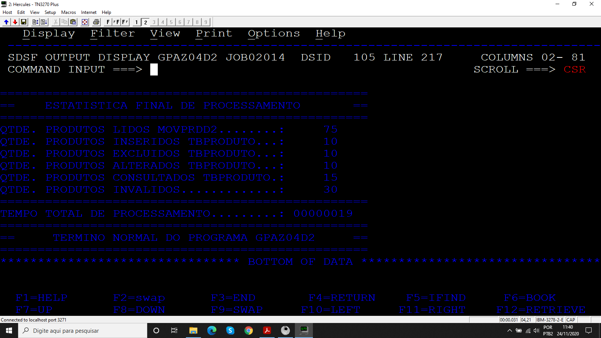
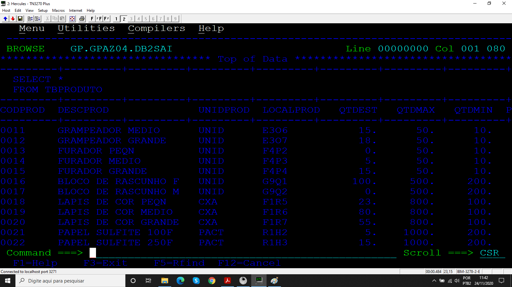

# Projeto_11
## Programa para atualizar tabela DB2

Programa desenvolvido durante o treinamento de Cobol da escola Grande Porte treinamentos.

## Objetivo

O programa atualiza a tabela TBPRODUTO com base na movimentação de estoque registrada no arquivo sequencial MOVPRDD2, além disso é mostrado na SYSOUT a estatística do processamento.

### Arquivos

* Código 
* JCL 
  * COMPCOBDB2
  * EXECOBD2
* MOVPRDD2

### Booklib

* VARDATA
* VARTEMPO
* ROTDATA
* ROTERRO
* CALCTEMP
* BK001D2

### Resultados

