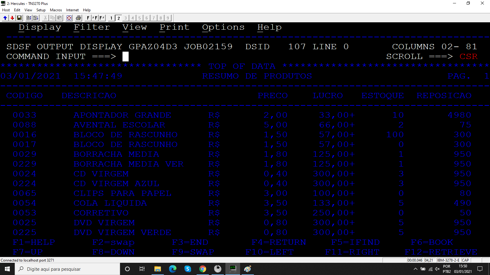

# Projeto_12
## Programa para selecionar itens de uma tabela DB2 e mostrar em um relatório.

Programa desenvolvido durante o treinamento de Cobol da escola Grande Porte treinametos.

## Objetivo

O programa  seleciona itens da tabela TBPRODUTO aqueles cuja quantidade em estoque é menor que o limite mínimo em ordem crescente de descrição, além disso é mostrado na SYSOUT a estatística do processamento.

### Arquivos

* Código 
* JCL 
  * COMPCOBDB2
  * EXECOBD3

### Booklib

* VARDATA
* VARTEMPO
* ROTDATA
* ROTERRO
* CALCTEMP
* BK002TP

### Resultados

