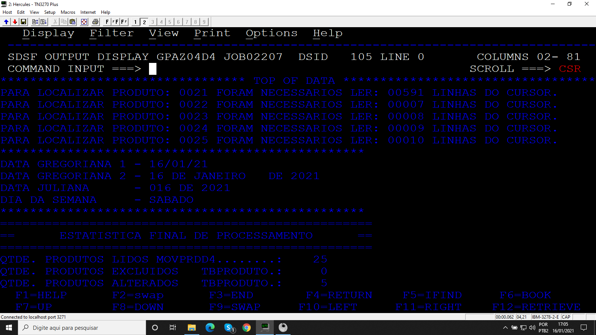
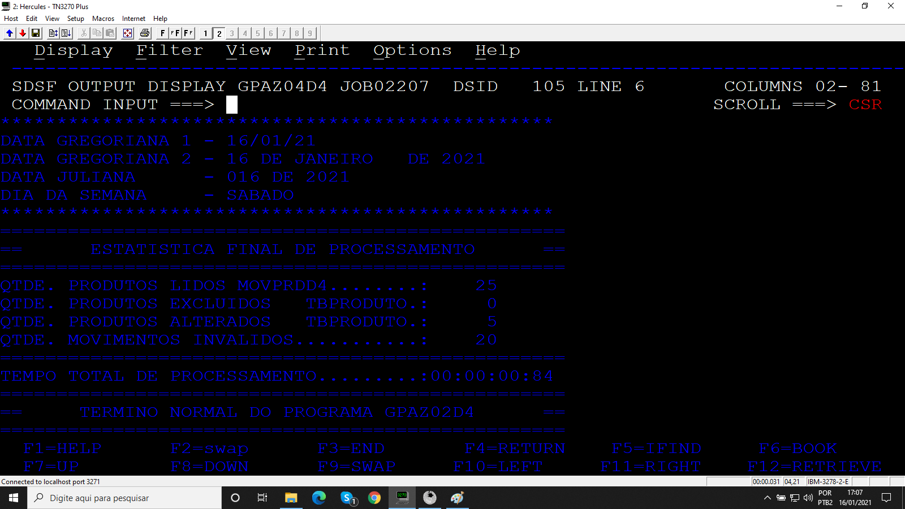

# Projeto_13
## Programa para fazer manutenção em uma tabela DB2 com base no arquivo MOVPRDD4.

Programa desenvolvido durante o treinamento de Cobol da escola Grande Porte treinametos.

## Objetivo

O programa  lê e atualiza a tabela usando a técnica da atualização posicionada via cursor. As alterações e exclusões estão gravadas no arquivo MOVPRDD4, além disso é mostrado na SYSOUT a estatística do processamento.

### Arquivos

* Código 
* MOVPRDD4
* JCL 
  * COMPCOBDB2
  * EXECOBD4

### Booklib

* VARDATA
* VARTEMPO
* ROTDATA
* ROTERRO
* CALCTEMP
* BK002TP
* BK002D4

### Resultados

