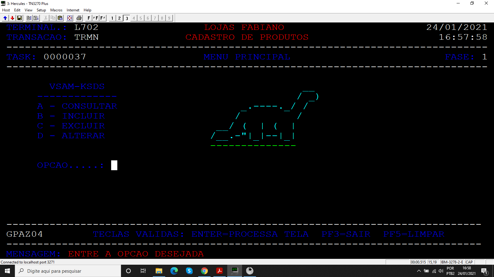
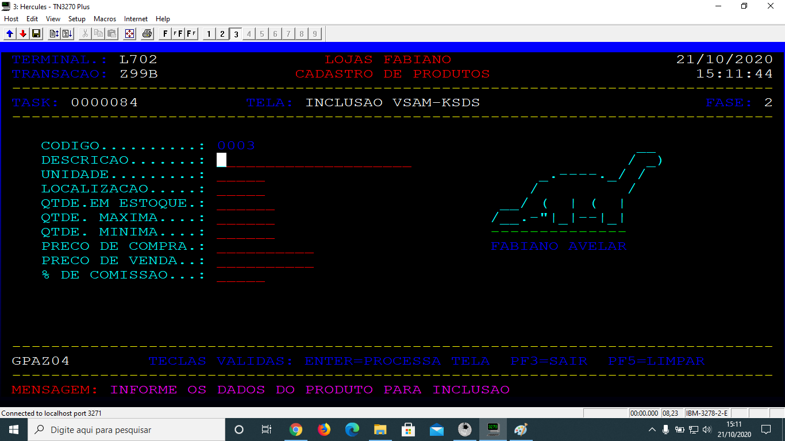
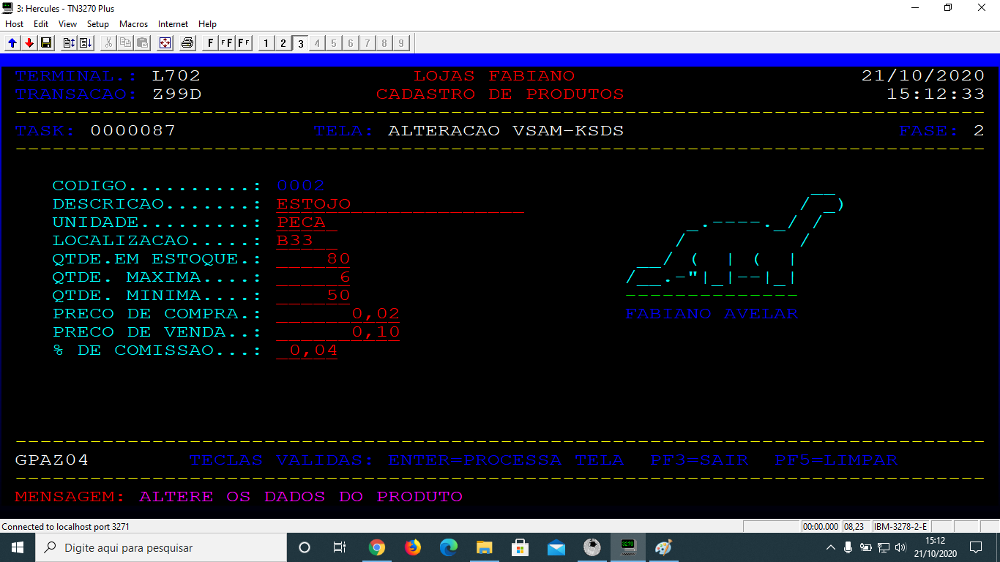

# Projeto_14
## Programa on-line para realizar operações básicas, consultar, incluir, alterar e listar.

Programa desenvolvido durante o treinamento de Cobol da escola Grande Porte treinametos.

## Objetivo

O programa on-line de consulta de estoque, onde poderão realizar as operações básicas de consultar, incluir, excluir, alterar e listar em tela os seus produtos. Usando para isso uma base de dados baseada em arquivos VSAM KSDS.

### Arquivos

* Mapas
  * AZ04MNU
  * AZ04CAD
* PROGRAMAS
  * AZ04PGMA
  * AZ04PGMB
  * AZ04PGMC
  * AZ04PGMD
  * AZ04PGMM
  * EEAZ04E8
* JCL 
  * COMPCICS
  * COMPMAPA
  * CRIAKSDS
* CADPRD

### Booklib

* VCADPRD

### Resultados

